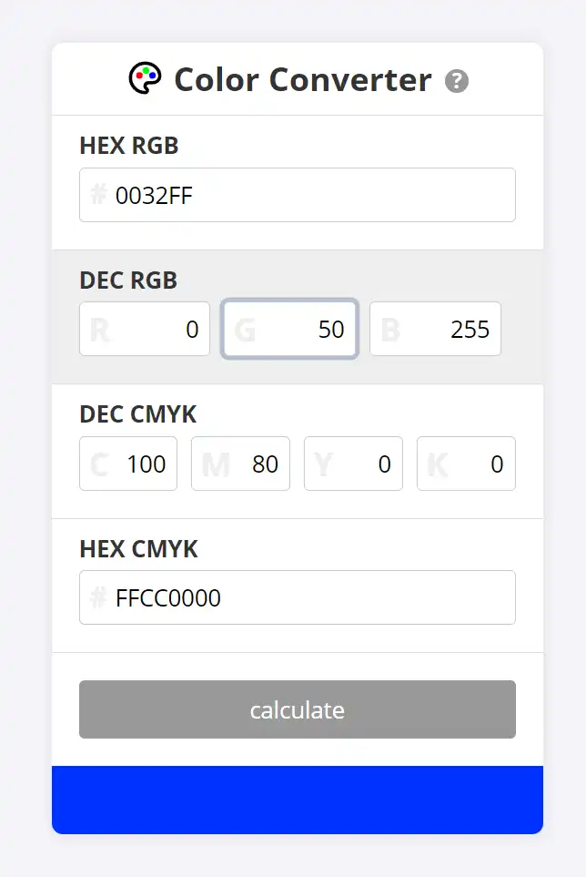

#  Color Converter
Simple html/javascript page to convert color from hex rgb to hex cmyk and back

Enter any value in one of the input fields and the corresponding other fields will be calculated when you leave the field. You can also hit the Enter key or the 'calculate'-button. If you enter values outside the permitted limits, meaningful values are inserted. The field below shows a representation of the entered color.

> [!TIP]
> You can use this page online or install it as a web app. You can also simply download the html page and use it offline.

Try it life [here](https://zenziwerken.github.io/colorconverter/) or copy the html to your PC an use it offline.  

Icon based on [tabler "palette"](https://tabler.io/icons/icon/palette).

